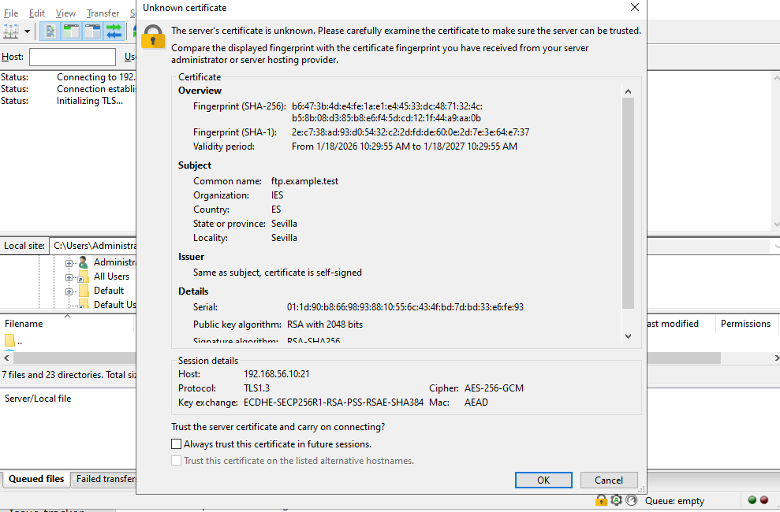
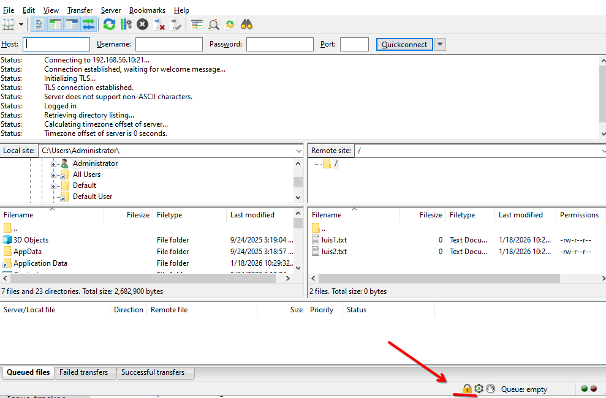

# FTP Server Documentation

Here i explain the process of the FTP server practice with Vagrant and vsftpd.

## 1. The Vagrantfile Config
I modified the Vagrantfile to have 2 virtual machines.
* **Server Machine:** I put the IP `192.168.56.10`. I also map the port 2121 to 21, so i can conect with Filezilla from my real computer easily.
* **Client Machine:** I put the IP `192.168.56.20`. I use this one to test commands inside the network.

## 2. The Provision Files
I organized the scripts in a folder called `provision`.

### The Server Script (`servidor.sh`)
This is the most important part. Here i did this steps:
1. **Install:** I instaled `vsftpd` and `openssl`.
2. **Users:** I created Luis (who is blocked in his home) and Maria (who is free). I also created the files `luis1.txt` etc.
3. **SSL:** I generated the certificate `.pem` for the secure connection.
4. **Configuration (`vsftpd.conf`):** I deleted the original file and put the new config:
    * `anonymous_enable=YES`: For anonimous access.
    * `anon_max_rate`: I put the limit of 2MB/s.
    * `chroot_local_user=YES`: To put everyone in jail (chroot).
    * `chroot_list_file`: I put Maria here so she is the exception.
    * `ssl_enable`: To force encryption for local users.
    * `force_local_logins_ssl=YES`: This is important, it blocks users without encryption.

### The Client Script (`cliente.sh`)
Here i instaled the basic `ftp` command and created the user `pepe`.

---

## 3. Commands Used in Console
Here i explain the commands i used in the linux terminal to verify the server:

* **`ftp 192.168.56.10`**: I used this command to check the Banner and the Anonymous user.
* **`lftp -u luis,luis 192.168.56.10`**: **IMPORTANT.** I had to install and use `lftp` becouse the normal `ftp` command gave me **Error 530**. This happens becouse i configured the server to force SSL/TLS for local users, and the old ftp command dont support encryption well.
* **`set ssl:verify-certificate no`**: Inside `lftp`, i need this to ignore the warning of the self-signed certificate.
* **`cd /etc`**: I used this to test the Jail (Chroot).
* **`wget ftp://192.168.56.10/test_speed.img`**: I used this command to download the big file. `Wget` shows the speed, so i can check if the limit of 2MB/s is working correctly.

---

## 4. Verification and Checks

I checked that everything works doing this:

1. **Banner:** When i connect as anonymous, i see the message "Welcome to system.sol".
2. **Jail Test:**
    * With **Luis**: I connected with `lftp` (secure). When i try `cd /etc`, it says "Access failed". He is in jail.
    * With **Maria**: I connected and she can go to `/etc`. She is free.
3. **Speed:** I downloaded the file with `wget` and the speed was stable at 2MB/s.

---

## 5. Filezilla Screenshots

Here are the captures of the client working from my computer.

### A. Passive Mode Analysis
I conected with `anonymous` user to port 21.
In the Filezilla log (the text at the top), i saw the server response:
`227 Entering Passive Mode (192,168,56,10,X,Y)`.

This confirms the server is using **Passive Mode**.
I also know the data port using the math formula with the last two numbers: `(X * 256) + Y`.

### B. Secure Connection (SSL)
When i connect with user `luis`, the server ask for the certificate.

### C. The Lock Icon
Here we can see the lock icon (candado) closed, that means the conection is secure and encripetd.

